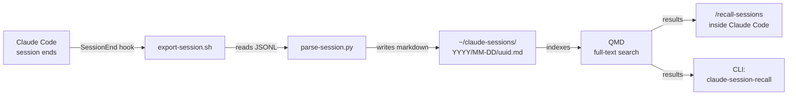

# claude-session-recall

> Search your Claude Code sessions like memory. Every session, automatically indexed. Every insight, instantly findable.

[](LICENSE)
[](https://www.python.org)
[](https://github.com/tobilu/qmd)
[]()

## What it does

Claude Code stores session transcripts as JSONL files buried in `~/.claude/projects/`. This tool automatically converts them into searchable markdown and indexes them with [QMD](https://github.com/tobilu/qmd) for full-text search. Every time a session ends, a hook exports it. You can then search across all your sessions instantly.

## Quick Install

```bash
git clone https://github.com/lisardo-iniesta/claude-session-recall.git
cd claude-session-recall
./install.sh
```

The installer will:
1. Check prerequisites (Python 3.8+, Node.js)
2. Install [QMD](https://github.com/tobilu/qmd) 2.0+ (or upgrade if < 2.0)
3. Ask where to save session markdown (default: `~/claude-sessions/`)
4. Register a `SessionEnd` hook in `~/.claude/settings.json`
5. Install the `/recall` command and `/recall-sessions` skill for use inside Claude Code
6. Add `claude-session-recall` and `claude-session-backfill` to your PATH

> **Important:** Restart Claude Code after installing for the hook to take effect. Make sure `~/.local/bin` is in your `PATH`.

Then backfill your existing sessions:

```bash
claude-session-backfill
```

## Usage

### Inside Claude Code (recommended)

Two ways to search — both work, pick whichever you prefer:

**`/recall-sessions` (skill)** — richer context, Claude understands session metadata and can read full transcripts:
```
/recall-sessions that bug we fixed last week
```

**`/recall` (custom command)** — lightweight, quick search:
```
/recall authentication flow
/recall how did we set up docker
/recall that bug we fixed last week
```

The skill gives Claude more context about how to parse results, read full session files, and present findings with date/project/branch metadata.

### Deep search (QMD 2.0+)

Default search uses fast BM25 keyword matching (<1s). For harder queries, QMD 2.0+ also supports hybrid search with semantic embeddings and LLM reranking (~13s):

```bash
# Hybrid search (slower, higher quality)
qmd --index sessions query "authentication refactoring"

# Disambiguate with --intent
qmd --index sessions query --intent "the recall skill, not auth" "recall"
```

### From the terminal

```bash
# Search your session history
claude-session-recall "authentication flow"

# Get more results
claude-session-recall -n 10 "docker deployment"

# JSON output for scripting
claude-session-recall --json "refactoring patterns"

# Preview what backfill would export (no writes)
claude-session-backfill --dry-run
```

## How it works



1. **SessionEnd hook** fires when you exit Claude Code — receives session ID and transcript path via stdin
2. **parse-session.py** reads the JSONL, extracts user/assistant messages (discards tool calls, thinking blocks), builds YAML-frontmattered markdown
3. **Markdown** is written to `~/claude-sessions/YYYY/MM-DD/<session-id>.md`
4. **QMD** indexes the new file for full-text search (BM25 keywords; hybrid search available via `qmd query`)
5. **Search** via `/recall-sessions` skill or `/recall` command inside Claude Code, or `claude-session-recall` CLI

### Output format

Each session becomes a markdown file with YAML frontmatter:

```yaml
---
session_id: 5744b25e-12f9-4d8c-8554-6d19527c9d74
date: 2026-03-06
project: my-project
branch: main
model: claude-opus-4-6
cwd: /Users/me/projects/my-project
messages: 12
tags: [claude-session]
---

# Session: my-project -- 2026-03-06

## User
How does the auth system work?

## Assistant
The authentication system uses a three-step flow...
```

Sessions with fewer than 200 words are skipped (configurable).

## Configuration

| Environment Variable | Default | Description |
|---------------------|---------|-------------|
| `CLAUDE_RECALL_OUTPUT_DIR` | `~/claude-sessions` | Where to save session markdown |
| `CLAUDE_RECALL_MIN_WORDS` | `200` | Minimum words to export a session |
| `CLAUDE_RECALL_LOG` | `~/.local/share/claude-session-recall/export.log` | Log file location |
| `CLAUDE_SESSION_RECALL_PREFIX` | `~/.local` | Installation prefix |

## Requirements

- **Python 3.8+** (stdlib only — no pip install needed)
- **Node.js 16+** (for QMD)
- **QMD 2.0+** (installed automatically by `install.sh`)
- **Claude Code** (the thing you're searching)
- **macOS or Linux** (bash required; on Windows, use WSL)

## Uninstall

```bash
./uninstall.sh
```

This removes the hook, commands, and library files. Your exported sessions (`~/claude-sessions/`) and QMD index are preserved -- delete them manually if desired.

## Comparison

| Tool | Search | /recall in Claude Code | Auto-export | Dependencies |
|------|--------|------------------------|-------------|--------------|
| **claude-session-recall** | Full-text + hybrid (QMD) | Yes | SessionEnd hook | Python stdlib + Node.js (QMD) |
| [claude-code-transcripts](https://github.com/simonw/claude-code-transcripts) | No | No | No | pip (uv) |
| [claude-conversation-extractor](https://github.com/ZeroSumQuant/claude-conversation-extractor) | Yes (spaCy opt.) | No | No | pip |
| [cctrace](https://github.com/jimmc414/cctrace) | No | No | No | pip |

## Troubleshooting

**No search results after install?**
Run `claude-session-backfill` to index existing sessions. New sessions are indexed automatically.

**Hook not firing?**
Check `~/.claude/settings.json` has the SessionEnd entry. Hooks are snapshotted at session start -- restart Claude Code after installing.

**Sessions directory empty?**
The hook only exports sessions with 200+ words. Set `CLAUDE_RECALL_MIN_WORDS=50` to lower the threshold.

**`qmd` not found?**
```bash
npm install -g @tobilu/qmd
```

## License

MIT -- see [LICENSE](LICENSE).
